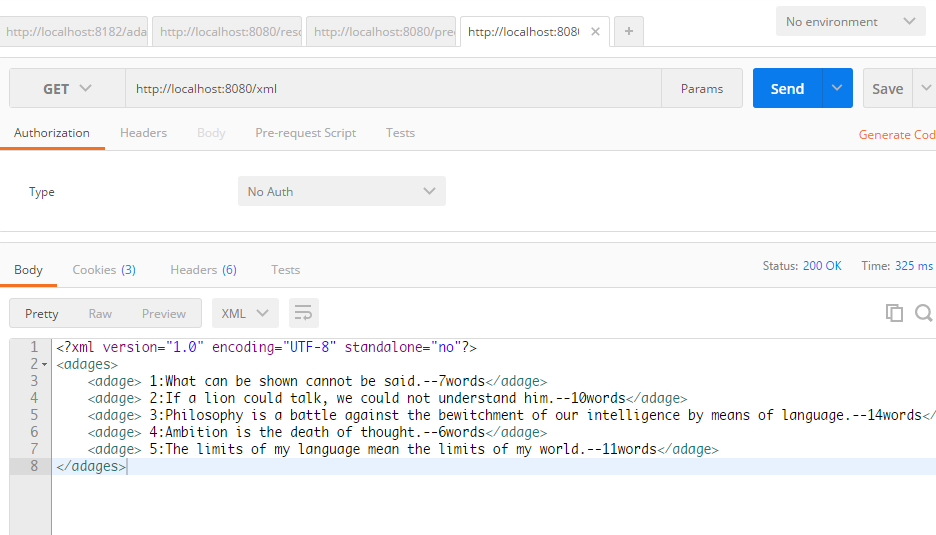
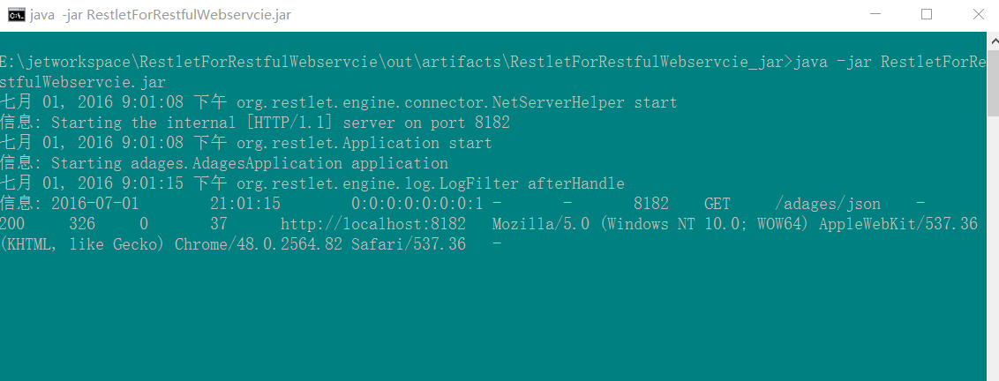

##Restlet 写的 Restful webservice demo（A demo of restful webservice is written by Restlet Framework ）


见[《webservice笔记4——Restlet开发restful webservice教程》](http://www.dabu.info/webservice-restful-use-restlet.html)

截图：



编译：
注意：导入 org.restlet的相关jar库的时候，必须选择是jee的而不是是jse的。否则接收请求后会报错，如下：

```
WARNING: Exception or error caught in server resource
java.lang.AbstractMethodError: org.restlet.engine.converter.ConverterHelper.score(Ljava/lang/Object;Lorg/restlet/representation/Variant;Lorg/restlet/resource/Resource;)F
	at org.restlet.engine.converter.ConverterUtils.getBestHelper(ConverterUtils.java:137)
	at org.restlet.service.ConverterService.toRepresentation(ConverterService.java:229)
	at org.restlet.resource.Resource.toRepresentation(Resource.java:738)
	at org.restlet.resource.ServerResource.doHandle(ServerResource.java:509)
	at org.restlet.resource.ServerResource.get(ServerResource.java:695)
	at org.restlet.resource.ServerResource.head(ServerResource.java:977)
	at org.restlet.resource.ServerResource.doHandle(ServerResource.java:587)
	at org.restlet.resource.ServerResource.doNegotiatedHandle(ServerResource.java:637)
	at org.restlet.resource.ServerResource.doConditionalHandle(ServerResource.java:336)
	at org.restlet.resource.ServerResource.handle(ServerResource.java:899)
	at org.restlet.resource.Finder.handle(Finder.java:243)
	at org.restlet.routing.Filter.doHandle(Filter.java:156)
	at org.restlet.routing.Filter.handle(Filter.java:203)
	at org.restlet.routing.Router.doHandle(Router.java:428)
	at org.restlet.routing.Router.handle(Router.java:645)
	at org.restlet.routing.Filter.doHandle(Filter.java:156)
	at org.restlet.routing.Filter.handle(Filter.java:203)
	at org.restlet.routing.Filter.doHandle(Filter.java:156)
	at org.restlet.routing.Filter.handle(Filter.java:203)
	at org.restlet.routing.Filter.doHandle(Filter.java:156)
	at org.restlet.engine.application.StatusFilter.doHandle(StatusFilter.java:151)
	at org.restlet.routing.Filter.handle(Filter.java:203)
	at org.restlet.routing.Filter.doHandle(Filter.java:156)
	at org.restlet.routing.Filter.handle(Filter.java:203)
	at org.restlet.engine.CompositeHelper.handle(CompositeHelper.java:208)
	at org.restlet.engine.application.ApplicationHelper.handle(ApplicationHelper.java:81)
	at org.restlet.Application.handle(Application.java:378)
	at org.restlet.routing.Filter.doHandle(Filter.java:156)
	at org.restlet.routing.Filter.handle(Filter.java:203)
	at org.restlet.routing.Router.doHandle(Router.java:428)
	at org.restlet.routing.Router.handle(Router.java:645)
	at org.restlet.routing.Filter.doHandle(Filter.java:156)
	at org.restlet.routing.Filter.handle(Filter.java:203)
	at org.restlet.routing.Router.doHandle(Router.java:428)
	at org.restlet.routing.Router.handle(Router.java:645)
	at org.restlet.routing.Filter.doHandle(Filter.java:156)
	at org.restlet.routing.Filter.handle(Filter.java:203)
	at org.restlet.engine.CompositeHelper.handle(CompositeHelper.java:208)
	at org.restlet.Component.handle(Component.java:389)
	at org.restlet.Server.handle(Server.java:513)
	at org.restlet.engine.ServerHelper.handle(ServerHelper.java:69)
	at org.restlet.engine.adapter.HttpServerHelper.handle(HttpServerHelper.java:149)
	at org.restlet.ext.servlet.ServerServlet.service(ServerServlet.java:1086)
	at javax.servlet.http.HttpServlet.service(HttpServlet.java:717)
	at org.apache.catalina.core.ApplicationFilterChain.internalDoFilter(ApplicationFilterChain.java:290)
	at org.apache.catalina.core.ApplicationFilterChain.doFilter(ApplicationFilterChain.java:206)
	at org.apache.catalina.core.StandardWrapperValve.invoke(StandardWrapperValve.java:233)
	at org.apache.catalina.core.StandardContextValve.invoke(StandardContextValve.java:191)
	at org.apache.catalina.core.StandardHostValve.invoke(StandardHostValve.java:127)
	at org.apache.catalina.valves.ErrorReportValve.invoke(ErrorReportValve.java:102)
	at org.apache.catalina.valves.RemoteIpValve.invoke(RemoteIpValve.java:647)
	at org.apache.catalina.core.StandardEngineValve.invoke(StandardEngineValve.java:109)
	at org.apache.catalina.connector.CoyoteAdapter.service(CoyoteAdapter.java:298)
	at org.apache.coyote.http11.Http11AprProcessor.process(Http11AprProcessor.java:864)
	at org.apache.coyote.http11.Http11AprProtocol$Http11ConnectionHandler.process(Http11AprProtocol.java:579)
	at org.apache.tomcat.util.net.AprEndpoint$Worker.run(AprEndpoint.java:1665)
	at java.lang.Thread.run(Thread.java:636)   ``

```


RestletForRestWebservcie可以放在tomcat中，也可以单独的导出为jar文件 单独作为http服务器运行(见 jarFile/RestletForRestfulWebservcie.jar)。


有两种运行方式：
1.以独立的形式运行，直接运行Main.java。此时，你可以将该项目编译为jar文件。
注意：
如果编译的jar运行的时候有报错“中没有主清单属性”，则说明你MANIFEST.MF（清单文件）放错了位置。
你MANIFEST.MF（清单文件）必须放在 src/main/resources/META_INF/


运行后访问的地址:
http://localhost:8182/adages/

获取单个的xml记录:
http://localhost:8182/adages/xml/1


截图：



2.在tomcat中运行。
这种方式需要在web.xml中配置一个Servlet作为拦截器。如下:
```
<?xml version="1.0" encoding="UTF-8"?>
<web-app xmlns="http://xmlns.jcp.org/xml/ns/javaee"
         xmlns:xsi="http://www.w3.org/2001/XMLSchema-instance"
         xsi:schemaLocation="http://xmlns.jcp.org/xml/ns/javaee http://xmlns.jcp.org/xml/ns/javaee/web-app_3_1.xsd"
         version="3.1">


    <!-- Restlet adapter -->
    <servlet>
        <servlet-name>RestletServlet</servlet-name>
        <servlet-class>org.restlet.ext.servlet.ServerServlet</servlet-class>
        <init-param>
            <!-- Application class name -->
            <param-name>org.restlet.application</param-name>
            <param-value>adages.AdagesApplication</param-value>
        </init-param>
    </servlet>

    <!-- Dispach all requests to the Restlet servlet. -->
    <servlet-mapping>
        <servlet-name>RestletServlet</servlet-name>
        <url-pattern>/*</url-pattern>
    </servlet-mapping>


</web-app>
```


访问:
http://localhost:8080/xml


获取单个的xml记录:
http://localhost:8080/xml/1


